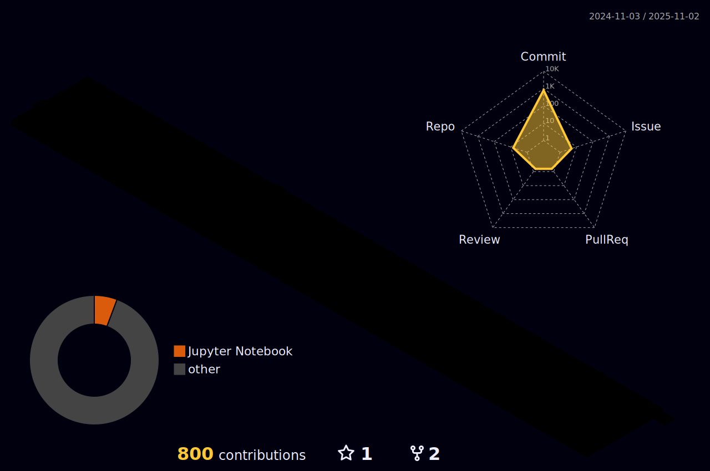

<body>
  

    <h1> Hi there, I'm Mohammad Asif Ibna Mustafa👋<a href="#"></h1>
  

### I'm a Softare Developer, Web Developer and Researcher!
- 🔭 I’m currently working on **my portfolio**.
- 🌱 I’m currently expanding my knowledge in DevOps.
- 👯 I’m looking to collaborate with other content creators and developers.
- 🥅 2022-23 Goals: Contribute more to Open Source projects and Execute my Innovative ideas.
- 💎 If you are a Tech boy/girl let's get connected  
 
<h2>Tech Stack</h2>

	  
#### LANGUAGES 

![MATLAB](https://img.shields.io/badge/-MATLAB-black?style=flat-square&logo=data:image/png;base64,iVBORw0KGgoAAAANSUhEUgAAADAAAAAwCAYAAABXAvmHAAAABmJLR0QA/wD/AP+gvaeTAAAGJUlEQVRoge1Za2wUVRT+zsxut9su3S2tIBaBtkjAStFI2lg1KVBTayhEXhoevgJoTBSIUWOM0l9ILakPmojWoPgALRACAlWQKBKhKgEMkVbbQsEKiqXbmW3Z7dyZOf5oa2vZZR+dJTHhSyaTuffc75xv7p17z70DXMd1/P9Q1NzsfvHQlu2NlRN9/rXuelHhLoqVi6wMLBI80Nw8IbXzr32r9ywZO8K4BIcdsMsQso0foFXK19HySfEIMhQerG9NA6TdCw5XjE3xXxpYZYdJW7g8/aZoOa+ZgDJmqTtB1GSeP3HLlJZvgpmkm7JRGS3vNRPw0+mWZwFMv//I+pA2BH5IVHgKo+G9JgKKm5rGM7Amu6UOWX8cu6qtTHg1Gu74C2AmmWzvAHAW/PhRBOaYJl5PvTdS+rgLKGk6/Th3B4rSzp5E1tm6iNoQ4+VI+eMqoPTo0XQoSjmrCu78cQuIOcKWXKytScmPxDJ+AphJ+AMbWVXTE9ouIKfxQHTNQSsisYubgOKv9r/Aqlpq+lRMPFkLm6FFR8A011fmGhHOLC4C7tu5cwV3+tawqgKKgslNQef9cEiQJfmxcEa2WJhD4b5t224hISpZUWeyLgChY9TFBni6LgKJMRAyPcllWEdlMEOZWCLgrpoap8vvXw1FXcW6SGChA7oAdB2TTn8/FOosRXPPAJT9oQyGLKCkunq04fXuMYXIhdDR9+ahCyReVjCmvRFwxs4vkbQMQEgBQ/oGZlRVpYnOzgOGouSyqoJVBayqYF/PPfvcUUihez8iMMxS70qPJ1R9zD1wV2WlE4qyi3V9Aoue4QJdoG/4kKYhu70BcMTqoQ+UaNoxB8DGYLUxC3C2t7/LQhRA7x82A4dPhnIOTiMAK7YcDCyEFQKKamrckmk+xEIsZ1UVRn29zt0BG3S9X4CugzQNWR1NFrz9XjCmtT4zfPTo9e2tUQsoKyuT6vLzC0xNWwJNLAYbSWAGJTphm3Tr7+LY0VRWVRdpGkjrGTrDA1645S6LogcASMTGwwDWRSxg5uHDGUa3WFynactZF1kIlsbI8s222+/oNo8fb0fDr8NJ0wBNIFNuBZKtjB8AKLyAksZGByuds0hoj+i6KAGzHDb9InJIkyc74Ey6hG8Ppnl0H1wuYWHgvWDc2bLUnTnufeXMwGIJAIobG3NKTjWsxeVAK4FrmDATgBwV/9gxaVLRtK5Rsmph1P+FbkrzBpdJACCzNAXAUwDSY2Y3DIyoO5BsYyNminAgxtzBZRIA7J2QvdnGRi6AgzExmyZce3fB8ecVk4TVyPtlfuqYgQX/rsRf5OScq829bRqBVgKIPPc1DCTt2gF7wynrwgwNYuY5Awv+m0oQ8d6pd7wlmcZUEE6GZQsE4Pp0k2n/JaypdSCaNfAxaC60t6Dg5DBJygfwNhB0AoV8/g8kV70h5NPNVu8p9DD19xwv7M+NQjrfWlDg/3J64QqSUALgQj+9gOOrWiRXvWFKHV77kMPtAQNYT5J0m/x8h102jHQCHmVCsKNGe3cC3d/3EFGiMmPnzpEy00bbiWN5js8+1qW2thsH2xAB7iQgJannPszZeyURXE7AlQgkO4DkxJ4rMaHnctih2e2Yb3uuY1cw3+pLqfdqAhXdfs4PXCb4O4EuBZvz93kXARGm0wdmz/5r3+zSmXnAyB0NzaMY4iYCLwbwQyTtrwrC0lDBA0DKa95DaWe9dxOwCoC/t7jkm8KeRXjIqeK89JRFDKomgjOGHvjA80rHE5H6OvOY5/auLtrepSCry8eF0490HBzyB7itTf2UiOcCUe9czooEW0RHJ33I/LDjhGk3pwLYzYxSwKJTiW1/q7UA1kbRhIl42Q0vtvmi9ZW7WfHmFXhnw6QmwMIfHCXj4cgQ7uZhScgIP4Soely5d7kVfi2bw2ub0G0SXZHuBkGLATxvlV9LFyGbZnyCqy9EukTSwuxyr2KVT0sFvHfe1wbCoZAGxE9PerP9iJU+43G0GHRtYMbqvA1KtdXOLD1a7MXxQc86mFZN3+StioMv6wWYhvnzgI79TWIsK/3c+53VfvpguQC7I6kVCNQDvMHjUTcs2BrF3uI6ruPa4x/2kYd93Kr/1wAAAABJRU5ErkJggg==)

#### APP DEVELOPMENT

#### WEB DEVELEOPMENT

#### DATABASES

#### VERSION CONTROLS

	  
<!---
#### AR/VR

	  
-->	  
	  
<h2> Connect with me! </h2>

 
 

<!---
## Personal Projects

|      Project :octocat:   |     Issues :bug:   | Open PRs :bell:  | Closed PRs :fire:  | Last Commit 🚩
|-------------|-------------------|---|---| ----|
| [**Meeting Summarization**](https://github.com/saadfareed/transcript_summary) |  |   |   | |
| [**Github Profile**](https://github.com/saadfareed/saadfareed) |  |   |    | |
| [**Certificate Generator**](https://github.com/saadfareed/Certificate_generator) |  |   |    | |
| [**Leetcode Practice**](https://github.com/saadfareed/Leetcode) |  |   |    | |
-->
	
 
 <h2>GitHub Analytics
 </h2>

  

 

## ⚡️Github Contributions
	
<h4 align="center">Isometric view of contributions in the last year</h4>

	

## 🚀Github Metrics

	

 

## 🐛Github Magic Game

  

 

 
  Views 
  

